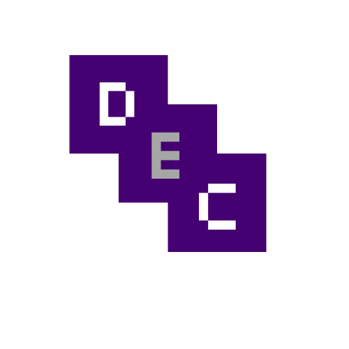

# 🚀 **Modern ELT Demo** 🚀




---

## 🌟 **Introduction**

Welcome to the **Modern ELT Demo Project**, where we create a cutting-edge ELT pipeline using **Airbyte**, **dbt**, **Snowflake**, and **Dagster**. 🌐


🔗 **Related Docs:**

- [Airbyte](https://docs.airbyte.com/)
- [dbt](https://docs.getdbt.com/docs/introduction)
- [AWS](https://aws.amazon.com)
- [Snowflake](https://docs.snowflake.com/en/)
- [Dagster](https://docs.dagster.io/getting-started)

---

## 🛠️ **Getting Started**

1. **Create a Snowflake Account**: Sign up [here](https://signup.snowflake.com/) ❄️

2. **Run SQL Setup**: Configure Airbyte with Snowflake by running the SQL script [snowflake_airbyte_setup.sql](integration/destination/snowflake_airbyte_setup.sql) 📜

3. **Set Environment Variables**: Export the following variables to your environment 🌍

   ```bash
   export AIRBYTE_PASSWORD=your_snowflake_password_for_airbyte_account
   export SNOWFLAKE_ACCOUNT_ID=your_snowflake_account_id

   ```

4. 🐍 **Install Python Dependencies**

Make sure to install all necessary Python packages before proceeding!

###### pip install requirements.txt

5.  🐘 **Create the Mock Source Database**

To set up the **PostgreSQL** database:

- Install [PostgreSQL](https://www.postgresql.org/) 📥
- Create a new database on your localhost called `dvdrental` 🗃️
- Unzip the file [dvdrental.zip](integration/source/dvdrental.zip) 📂
- Use PgAdmin4 to [restore dvdrental](https://www.pgadmin.org/docs/pgadmin4/development/restore_dialog.html) 🔧

---

### 🌐 **Using Airbyte**

1. **Create a source** for the PostgreSQL database `dvdrental` 📊
   - Host: `host.docker.internal` 💻
2. **Create a destination** for your Snowflake database ❄️
3. **Establish a connection** between `dvdrental` and `snowflake` 🔄
   - Namespace Custom Format: `<your_destination_schema>` 📁
4. **Run the sync job** to transfer data ⚙️

---

### ❄️ **Using Snowflake**

1. Log in to your **Snowflake** account 🌐
2. Navigate to `worksheets` > `+ worksheet` 📝
3. On the top right, select the role `ACCOUNTADMIN.AIRBYTE_WAREHOUSE` 🔐
4. On the top left of the worksheet, select `AIRBYTE_DATABASE.AIRBYTE_SCHEMA` 📚
5. Query one of the synced tables from Airbyte

---

### 📈 **Using dbt**

1. Navigate to the `dagster/dbt_warehouse` directory 📁
2. Run the following commands to generate and serve the dbt documentation:
   ````bash
   dbt docs generate
   dbt docs serve
   ``` 🎯 This will also allow you to view the lineage graph 📊
   ````
3. Execute the command `dbt build` to run and test dbt models

---

### 🧩 **Using Dagster**

1. `cd` to `dagster/analytics`
2. Execute the command `dagit` to launch the dagit user interface
3. Go to `workspace` > `jobs` > `elt_job` > `launchpad` > `launch run` to launch the run
