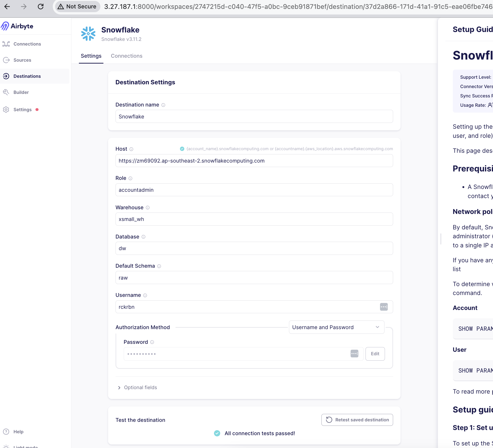

### CAPSTONE: Real-Time Development Application Data Pipeline for NSW Council Insights

| Author                                          |
| ----------------------------------------------- |
| Ben - [rockerben](https://github.com/rockerben) |

---

### 🌟 **Project Plan** 🌟

This project **boldly ventures where no council has gone before**. By integrating the **NSW Department of Planning, Industry, and Environment's DA Open APIs** into a data pipeline so dynamic, it practically has a life of its own, our local council will gain the kind of superpowers usually reserved for **superheroes** and **data scientists**. 🦸‍♂️💥

Imagine the council as the ultimate **urban planning ninja** 🥷, effortlessly slicing through data in real-time to stay miles ahead of the competition. With this project, not only will the council uncover valuable insights and generate metrics so sharp they could cut through red tape 🎯✂️, but they'll also have actionable intelligence that makes decision-making as easy as pie 🥧.

Think of it as a **seamless integration extravaganza** 🎉, with automated data updates that practically run themselves 🤖, and visualizations so intuitive, even your grandmother could use them (and she’d probably have some good ideas about zoning too) 👵. In short, this project will ensure that the council isn’t just keeping up with the times—they’re **setting the pace** in the high-stakes game of **urban planning and development monitoring**. Stay ahead of the curve? More like **rewriting the curve**. 🔄🏙️

---

### 🎯 **Objective**

To wrangle the **DA Open APIs** into a **super-slick data pipeline** that fetches, stores, and processes development application data faster than a **dancing kangaroo on caffeine**. 🦘☕ We’ll use this data to whip up insights, conjure metrics, and help **The Hills Shire Council** stay **ahead of the curve** in urban planning and development monitoring.

---

### 👥 **Consumers**

1. **Council Decision Makers & Urban Planners** 🏙️
2. **Council Compliance Officers** 👮‍♂️
3. **Council’s Finance and Budgeting Team** 💰
4. **Community and Public Relations Teams** 📣
5. **Data Analysts and Researchers** 📊
6. **Developers and Real Estate Professionals** 🏗️
7. **Local Government Partners (e.g., DPIE)** 🤝
8. **Public Stakeholders (Community Members, NGOs)** 🌍

---

### ❓ **Key Questions**

The DA Open APIs dataset can help answer a variety of key questions that provide actionable insights for the council and its stakeholders:

#### 🏗️ **For Urban Planners & Council Decision Makers:**

1. What is the **distribution of development applications** across different councils? 🗺️
2. What types of developments are most common in specific areas (residential, industrial, commercial)? 🏘️🏭
3. Are there any patterns in **development application approval times** across different councils? ⏳
4. How is the **cost of developments** trending over time in specific council areas? 💵
5. Which development categories (e.g., residential, industrial) are growing the fastest? 🚀

#### 👮‍♂️ **For Compliance Officers:**

6. How many development applications are currently under assessment or awaiting additional information? 📄
7. Are there any regions with high numbers of rejected or deferred applications? ❌
8. What percentage of development applications involve **subdivision proposals**? What type of subdivisions are being applied for (e.g., Strata Title, Torrens Title)? 🏠🏡
9. Are there developments proposing significant **variations to planning standards** (e.g., height limits, floor space ratio)? 📐

#### 💰 **For Finance and Budgeting Teams:**

10. What is the total **estimated cost of developments** across council areas for a given period? 💸
11. Which large-scale developments (by cost) are likely to impact infrastructure or require special budgeting considerations? 🚧
12. Are there clusters of **high-cost developments** in particular regions? 🏗️

---

#### 📊 **For Data Analysts & Researchers:**

13. How have **application trends changed** since 2018, particularly in response to economic conditions? 📈
14. Is there a correlation between the type of development (e.g., residential vs. industrial) and the time taken to approve applications? ⏱️
15. What is the **geographic distribution of new dwellings**, and are there clusters of high-density developments? 🏢
16. How many applications include **variations to development standards**, and what types of variations are most common? 📋

#### 🏘️ **For Developers & Real Estate Professionals:**

17. Which council areas have the **most active or pending applications**, and what types of developments are popular there? 🏗️
18. What is the average **cost of development applications** in specific categories (e.g., residential vs. commercial) by council area? 💲

---

#### 📢 **For Public Relations & Community Stakeholders:**

19. Which development applications are currently on **exhibition**, and when are their public consultation periods ending? 📅
20. How many applications have been determined (approved/rejected) within a certain timeframe in a particular region? ✅❌
21. What are the most common **reasons for rejection** of development applications across different council areas? 🤔

---

#### 🌍 **For Public Stakeholders & NGOs:**

22. Are there specific regions where certain types of developments (e.g., industrial) are being concentrated, and how might that impact the community? 🏭🏡
23. How many development applications involve **environmentally sensitive areas** or are subject to special infrastructure contributions (SIC)? 🌱
24. Which development applications are accompanied by **voluntary planning agreements (VPAs)**, and what is the status of these agreements? 📜

---

### 📁 **Source Datasets**

🔗 [DA Open APIs Dataset](https://www.planningportal.nsw.gov.au/opendata/dataset/online-da-data-api)

**Data Broker EMAIL:**  
✉️ [data.broker@environment.nsw.gov.au](mailto:data.broker@environment.nsw.gov.au)

---

### 🏗️ **Solution Architecture**

---

# Proof of Work

1. **Install Airbyte on EC2**
   

2. **Create a Postgres RDS**
   

   

3. **Create Airbyte Source Connection (Postgres)**
   

4. **Create Airbyte Destination Connection (Snowflake)**
   

5. **Test Extract/Load**

   1. **Airbyte UI**
      

   2. **Airbyte API (Python project)**
      

6. **Build containers**
   

7. **Trigger the ECS (manual test)**
   

8. **DBT Modelling**
   

9. DBT Python Config
   

10. Run Pipeline (set schedules)
    

# Proof of Work New

E L T

Github
airbyte
snowflake
dbt
dagster

1. select api
   play around with the api, use postman, get acquainted with it.

2. setup airbyte to snowflake connection
   source - api builder i used this as refernce to help me build the custom connector https://www.youtube.com/watch?v=IG0B8WXIQgs
   desitnation - we all have a snowflake destination connector setup
   connection - straight forward

3. run an extract in airbyte to have data in snowflake

- use the UI to run the sync

4. create a git repo
5. create a virtual enviroment

   1. dagster requirements
      1. conda create -n dagster python=3.11
      2. conda activate dagster
   2. dbt requirements
      1. pip install dbt-core==1.7.0
      2. pip install dbt-snowflake==1.7.0

6. scaffold a dagster proj

   1. /Users/rckrbnnew/Desktop/2024/2024-04-bootcamp/10-dagster/1/01-ins-ops-jobs/instruction/README.md

7. scaffold a dbt proj

- video 20240618 40:00
  -2024-04-bootcamp/06-snowflake-dbt/3/01-evr-dbt-setup/instruction/README.md

8. create 1 dbt model and run
9. configure dbt-dagster integration
10. test dagster
11. build dbt dim models
12. build dbt fact models
13. test run dbt models
14. build the one big table
15. setup dagster-airbyte integration
16. setup dagster-dbt integration
17. test run dagster
18. setup dagster cloud

19. other stuff
20. documentation

21. to do: Dagster deepdive
22. finish the Dagster testing code
23. to do: Data Vault deepdive
24. to do: Incremental Models
25. to do: data testing
26. todo: CICD
27. todo: Kafka learning
28. todo: Databricks/spark learning
29. todo: preset
30.

31. **Install Airbyte on EC2**
    

32. **Create a Postgres RDS**
    

    

33. **Create Airbyte Source Connection (Postgres)**
    

34. **Create Airbyte Destination Connection (Snowflake)**
    

35. **Test Extract/Load**

    1. **Airbyte UI**
       

    2. **Airbyte API (Python project)**
       

36. **Build containers**
    

37. **Trigger the ECS (manual test)**
    

38. **DBT Modelling**
    

39. DBT Python Config
    

40. Run Pipeline (set schedules)
    
    \*\*

---

# GIT

- [GIT Repository](https://github.com/rockerben/de-project2)

- Activity (6 branches, 7 merged pull requests and ~60 commits)

---

## Tasks

| ELT Pipeline |
| ------------ |

1. Time management
2. Install Airbyte on EC2
3. Create an Airbyte connection to Snowflake
4. Create a Postgres RDS
5. Airbyte API (using Python) - ECR, ECS to Extract and Load
6. Test Python engine
7. Develop Snowflake/DBT Tasks
8. DBT run (using Python) ECR, ECS to Transform
9. Pipeline Testing

| Project Delivery |
| ---------------- |

1. Setup and clean Scaffold
2. Solution Architecture
3. Project Presentation Materials
