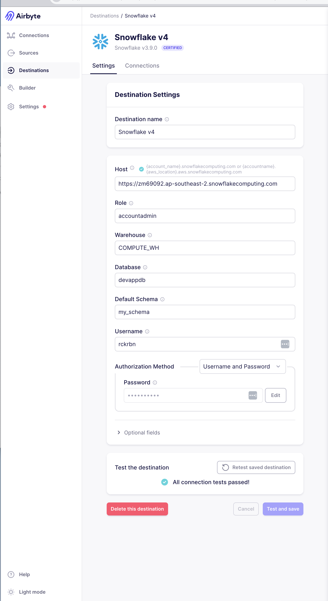

### CAPSTONE: Real-Time Development Applications (DAs) in NSW

| Proof of Work Images |
| -------------------- |

---

| ELT Pipeline |
| ------------ |

##### Github, Airbyte, Snowflake, Dbt, Dagster

---

| 1. Select API |
| ------------- |

| 2. Setup Airbyte to Snowflake connection |
| ---------------------------------------- |

- Source - I used this as reference to help me build the custom connector (https://www.youtube.com/watch?v=IG0B8WXIQgs)
- Destination - we all have a snowflake destination connector setup
- Connection - straight forward

&nbsp;

&nbsp;

&nbsp;

&nbsp;

&nbsp;

&nbsp;

&nbsp;

&nbsp;

    Run an extract in Airbyte to have data in Snowflake (localhost ok) - use the UI to run the sync

| 3. Create a Git Repo |
| -------------------- |

- [GIT Repository](https://github.com/rockerben/dec_capstone/)

| 4. Create a virtual enviroment |
| ------------------------------ |

- dagster requirements
  - conda create -n dagster python=3.11
  - conda activate dagster
- dbt requirements
  - pip install dbt-core==1.7.0
  - pip install dbt-snowflake==1.7.0

| 5. Scaffold a dagster project |
| ----------------------------- |

- 2024-04-bootcamp/10-dagster/1/01-ins-ops-jobs/instruction/README.md

| 6. Scaffold a dbt project |
| ------------------------- |

- Video reference: 20240618 @40:00 minute mark
- 2024-04-bootcamp/06-snowflake-dbt/3/01-evr-dbt-setup/instruction/README.md

| 7. _create 1 dbt model and run_ |
| ------------------------------- |

&nbsp;

| 8. _configure dbt-dagster integration_ |
| -------------------------------------- |

&nbsp;

| 9. _test dagster_ |
| ----------------- |

&nbsp;

| 10. _build dbt dim models_ |
| -------------------------- |

&nbsp;

| 11. _build dbt fact models_ |
| --------------------------- |

&nbsp;

| 12. _test run dbt models_ |
| ------------------------- |

&nbsp;

| 13. _build the one big table_ |
| ----------------------------- |

&nbsp;

| 14. _setup dagster-airbyte integration_ |
| --------------------------------------- |

&nbsp;

| 15. _setup dagster-dbt integration_ |
| ----------------------------------- |

&nbsp;

| 16. _test run local dagster_ |
| ---------------------------- |

&nbsp;

| 17. _setup dagster cloud_ |
| ------------------------- |

&nbsp;

| 18. _Other stuff_ |
| ----------------- |

- Documentation
- Solution Architecture
- Project Presentation Materials

| 19. _To do_ |
| ----------- |

- Dagster deepdive
- Data Vault deepdive
- Incremental Models
- Data Testing

| 20. _To be continued:_ |
| ---------------------- |

- CICD
- Kafka
- Databricks/Spark
- preset

---
