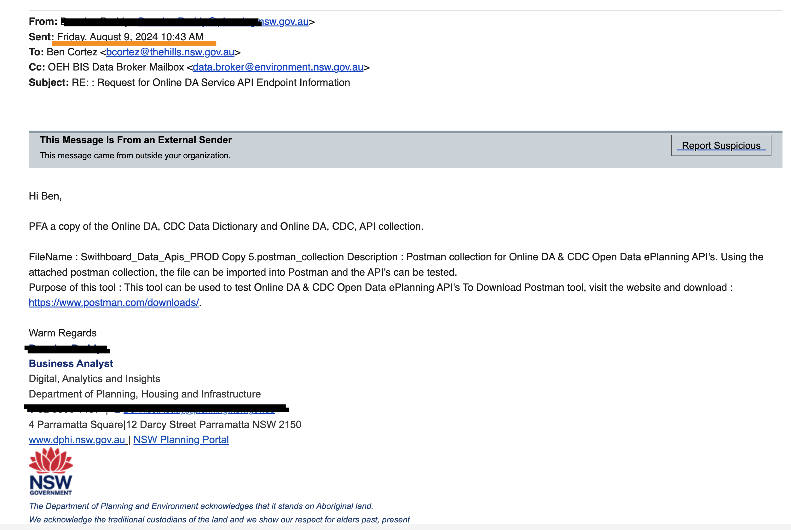
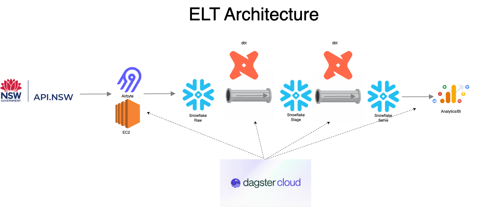

### CAPSTONE: Real-Time Development Applications (DAs) in NSW

| Author                                          |
| ----------------------------------------------- |
| Ben - [rockerben](https://github.com/rockerben) |

---

### **Project Plan**

This project **boldly ventures where no council has gone before**. By integrating the **NSW Department of Planning, Industry, and Environment's DA Open APIs** into a data pipeline so dynamic, it practically has a life of its own, our local council will gain the kind of superpowers usually reserved for **superheroes** and **data scientists**.

Imagine the council as the ultimate **urban planning ninja**, effortlessly slicing through data in real-time to stay miles ahead of the competition. With this project, not only will the council uncover valuable insights and generate metrics so sharp they could cut through red tape, but they'll also have actionable intelligence that makes decision-making as easy as pie.

Think of it as a **seamless integration extravaganza**, with automated data updates that practically run themselves, and visualizations so intuitive, even your grandmother could use them (and she’d probably have some good ideas about zoning too). In short, this project will ensure that the council isn’t just keeping up with the times—they’re **setting the pace** in the high-stakes game of **urban planning and development monitoring**. Stay ahead of the curve? More like **rewriting the curve**.

---

### **Objective**

To wrangle the **DA Open APIs** into a **super-slick data pipeline** that fetches, stores, and processes development application data faster than a **dancing kangaroo on caffeine**. We’ll use this data to whip up insights, conjure metrics, and help my workplace stay **ahead of the curve** in urban planning and development monitoring.

---

### **Consumers**

1. **Council Decision Makers & Urban Planners**
2. **Council Compliance Officers**
3. **Council’s Finance and Budgeting Team**
4. **Community and Public Relations Teams**
5. **Data Analysts and Researchers**
6. **Developers and Real Estate Professionals**
7. **Local Government Partners (e.g., DPIE)**
8. **Public Stakeholders (Community Members, NGOs)**

---

### **Key Questions**

The DA Open APIs dataset can help answer a variety of key questions that provide actionable insights for the council and its stakeholders:

#### **For Urban Planners & Council Decision Makers:**

1. What is the **distribution of development applications** across different councils?
2. What types of developments are most common in specific areas (residential, industrial, commercial)?
3. Are there any patterns in **development application approval times** across different councils?
4. How is the **cost of developments** trending over time in specific council areas?
5. Which development categories (e.g., residential, industrial) are growing the fastest?

#### **For Compliance Officers:**

6. How many development applications are currently under assessment or awaiting additional information?
7. Are there any regions with high numbers of rejected or deferred applications?
8. What percentage of development applications involve **subdivision proposals**? What type of subdivisions are being applied for (e.g., Strata Title, Torrens Title)?
9. Are there developments proposing significant **variations to planning standards** (e.g., height limits, floor space ratio)?

#### **For Finance and Budgeting Teams:**

10. What is the total **estimated cost of developments** across council areas for a given period?
11. Which large-scale developments (by cost) are likely to impact infrastructure or require special budgeting considerations?
12. Are there clusters of **high-cost developments** in particular regions?

---

#### **For Data Analysts & Researchers:**

13. How have **application trends changed** since 2018, particularly in response to economic conditions?
14. Is there a correlation between the type of development (e.g., residential vs. industrial) and the time taken to approve applications?
15. What is the **geographic distribution of new dwellings**, and are there clusters of high-density developments?
16. How many applications include **variations to development standards**, and what types of variations are most common?

#### **For Developers & Real Estate Professionals:**

17. Which council areas have the **most active or pending applications**, and what types of developments are popular there?
18. What is the average **cost of development applications** in specific categories (e.g., residential vs. commercial) by council area?

---

#### **For Public Relations & Community Stakeholders:**

19. Which development applications are currently on **exhibition**, and when are their public consultation periods ending?
20. How many applications have been determined (approved/rejected) within a certain timeframe in a particular region?
21. What are the most common **reasons for rejection** of development applications across different council areas?

---

#### **For Public Stakeholders & NGOs:**

22. Are there specific regions where certain types of developments (e.g., industrial) are being concentrated, and how might that impact the community?
23. How many development applications involve **environmentally sensitive areas** or are subject to special infrastructure contributions (SIC)?
24. Which development applications are accompanied by **voluntary planning agreements (VPAs)**, and what is the status of these agreements?

---

### **Source Datasets**

[DA Open APIs Dataset](https://www.planningportal.nsw.gov.au/opendata/dataset/online-da-data-api)

**Data Broker EMAIL:**  
[data.broker@environment.nsw.gov.au](mailto:data.broker@environment.nsw.gov.au)

---

### **Solution Architecture**

---

# Proof of Work

---

| ELT Pipeline |
| ------------ |

##### Github, Airbyte, Snowflake, Dbt, Dagster

---

| Tasks |
| ----- |

1. **Select API**
   &nbsp;
2. **Setup Airbyte to Snowflake connection**
   &nbsp;

   - Source - I used this as reference to help me build the custom connector (https://www.youtube.com/watch?v=IG0B8WXIQgs)
   - Destination - we all have a snowflake destination connector setup
   - Connection - straight forward
     &nbsp;
     Run an extract in Airbyte to have data in Snowflake (localhost ok) - use the UI to run the sync

   &nbsp;

3. **Create a Git Repo**

   &nbsp;

4. **Create a virtual enviroment**

   - dagster requirements
     - conda create -n dagster python=3.11
     - conda activate dagster
   - dbt requirements
     - pip install dbt-core==1.7.0
     - pip install dbt-snowflake==1.7.0

&nbsp;

5. **Scaffold a dagster project**

- 2024-04-bootcamp/10-dagster/1/01-ins-ops-jobs/instruction/README.md

  &nbsp;

6. **Scaffold a dbt project**

   - Video reference: 20240618 @40:00 minute mark
   - 2024-04-bootcamp/06-snowflake-dbt/3/01-evr-dbt-setup/instruction/README.md

&nbsp;

7. **_create 1 dbt model and run_**

&nbsp;

8.  **_configure dbt-dagster integration_**
    &nbsp;

9.  **_test dagster_**
    &nbsp;

10. **_build dbt dim models_**
    &nbsp;

11. **_build dbt fact models_**
    &nbsp;

12. **_test run dbt models_**
    &nbsp;

13. **_build the one big table_**
    &nbsp;

14. **_setup dagster-airbyte integration_**
    &nbsp;

15. **_setup dagster-dbt integration_**
    &nbsp;

16. **_test run dagster_**
    &nbsp;

17. **_setup dagster cloud_**
    &nbsp;

18. **_Other stuff_**

    - Documentation
    - Solution Architecture
    - Project Presentation Materials

    &nbsp;

19. To do:

    - Dagster deepdive
    - Data Vault deepdive
    - Incremental Models
    - Data Testing

    &nbsp;

20. To be continued:
    - CICD
    - Kafka learning
    - Databricks/spark learning
    - preset

---
